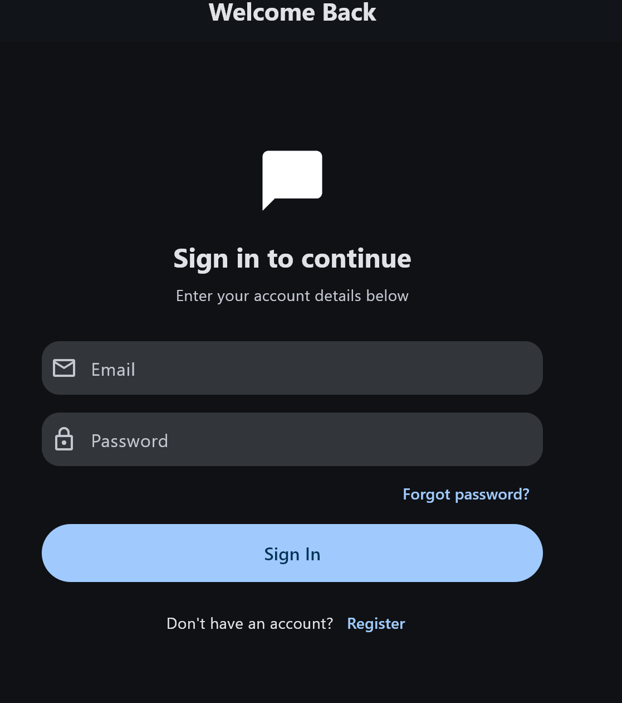
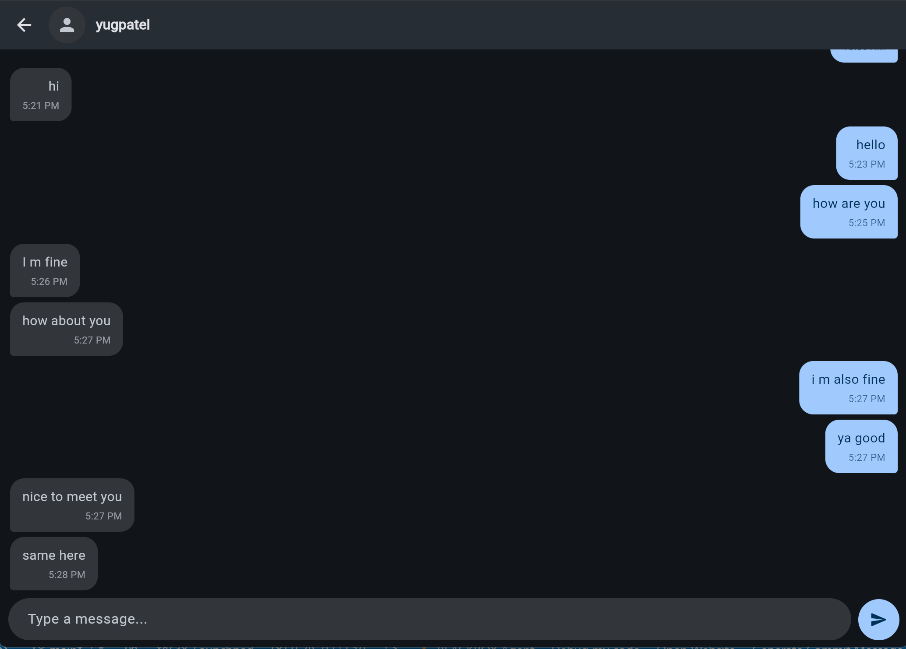
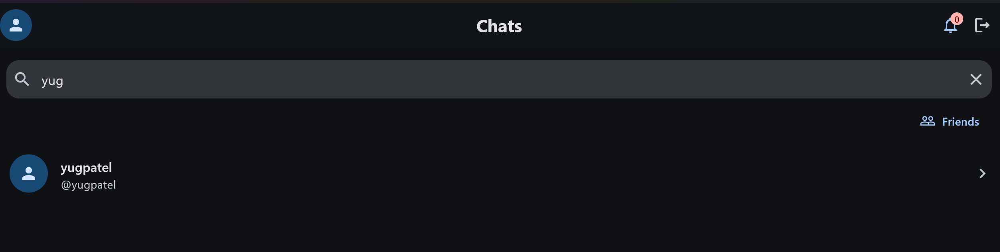
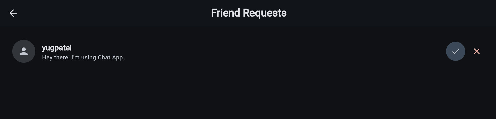
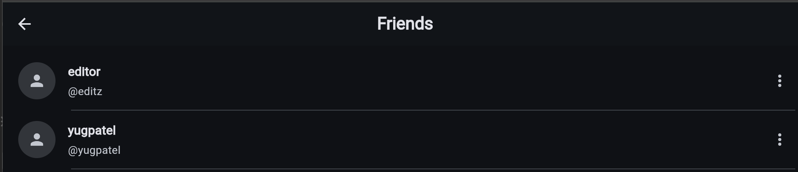
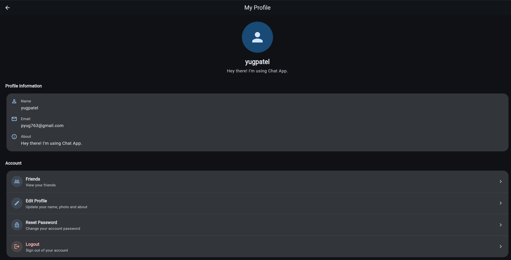

# Chat App

A real-time one-to-one chat application built with **Flutter, Dart, Firebase Authentication, Cloud Firestore, and Riverpod**.

The project follows a layered architecture so that the UI does not communicate directly with Firebase.

## Screenshots

| Login | Chat |
|---|---|
|  |  |

| Search | Friend Requests |
|---|---|
|  |  |

| Friends | My Profile |
|---|---|
|  |  |

## Features

### Authentication
- User registration and login
- Email verification
- Forgot password
- Logout

### Users & Profiles
- Search users
- View user profiles
- Edit profile
- Profile photo
- Custom display names for chat contacts

### Friendships
- Send friend requests
- Cancel friend requests
- Accept friend requests
- Reject friend requests
- Friends list
- Real-time relationship updates
- In-app friend-request notification bell

### Chat
- Real-time one-to-one messaging
- Persistent message history
- Real-time chat-list updates
- Deterministic chat IDs
- Delete chat from the current user's chat list
- Custom display names for individual chat contacts

## Tech Stack

- Flutter
- Dart
- Firebase Authentication
- Cloud Firestore
- Riverpod
- Material UI

## Architecture

The application follows a layered architecture:

```text
UI
 ↓
Provider
 ↓
Controller
 ↓
Repository
 ↓
Firebase / Firestore
```

### UI

Handles screens, widgets, user interaction, and displaying application state.

### Provider

Exposes application state to the UI using Riverpod.

### Controller

Handles application actions and write operations.

### Repository

Handles Firebase Authentication and Firestore operations.

The UI does not communicate directly with Firestore.

## Project Structure

```text
lib/
│
├── core/
│
├── features/
│   │
│   ├── auth/
│   │   ├── controller/
│   │   ├── data/
│   │   ├── providers/
│   │   └── presentation/
│   │
│   ├── profile/
│   │   ├── controllers/
│   │   ├── providers/
│   │   ├── repository/
│   │   └── presentation/
│   │       ├── screens/
│   │       └── widget/
│   │
│   ├── friends/
│   │   ├── controllers/
│   │   ├── data/
│   │   │   ├── enum/
│   │   │   └── models/
│   │   ├── providers/
│   │   ├── repository/
│   │   └── presentation/
│   │       ├── screens/
│   │       └── widgets/
│   │
│   └── chat/
│       ├── controllers/
│       ├── data/
│       │   ├── models/
│       │   └── repository/
│       ├── providers/
│       └── presentation/
│
└── main.dart
```

## Firestore Structure

### Users

```text
users/
└── userId
    ├── uid
    ├── name
    ├── username
    ├── email
    ├── photoUrl
    ├── about
    ├── onlineStatus
    ├── lastSeen
    └── nicknames
        └── otherUserId: nickname
```

`nicknames` stores private custom display names assigned by the current user to other users.

### Relationships

```text
relationships/
└── relationshipId
    ├── participants
    ├── senderId
    ├── receiverId
    ├── status
    ├── createdAt
    └── updatedAt
```

Relationship statuses:

```text
pending
accepted
rejected
```

Relationship IDs are generated deterministically from the two participant UIDs.

### Chats

```text
chats/
└── chatId
    ├── participants
    ├── lastMessage
    ├── lastMessageTime
    ├── lastMessageSenderId
    ├── createdAt
    ├── updatedAt
    ├── unreadCount
    └── deletedFor
```

### Messages

```text
chats/
└── chatId/
    └── messages/
        └── messageId
            ├── senderId
            ├── receiverId
            ├── text
            ├── chatId
            ├── type
            ├── delivered
            └── seenStatus


## Friend Request Model

Incoming friend requests use a combined model:

```text
FriendRequestModel
├── UserModel
└── RelationshipModel
```

This gives the UI both the request sender's information and the relationship data required for accept/reject actions.

## Real-Time Data

Firestore streams are used for real-time application data:

text
Firestore
 ↓
Stream
 ↓
Riverpod Provider
 ↓
UI
 ↓
Automatic Update
```

Real-time functionality includes:

- Chat list updates
- New messages
- Friend requests
- Relationship changes
- Friends list updates
- Custom chat display-name updates

## Application Flow

### Authentication

text
Login / Register
 ↓
Firebase Authentication
 ↓
Auth State
 ↓
Auth Gate
 ↓
Home
```

### Friend Requests

text
Search User
 ↓
Open Profile
 ↓
Send Friend Request
 ↓
Relationship Created
 ↓
Incoming Request Stream
 ↓
Accept / Reject
 ↓
Friends List
```

### Chat

text
Select Friend
 ↓
Generate Deterministic Chat ID
 ↓
Open Chat
 ↓
Load Messages
 ↓
Send Message
 ↓
Firestore
 ↓
Real-Time Stream
 ↓
Message Appears
```

### Custom Display Name

text
Chat Tile
 ↓
Edit Display Name
 ↓
Save Nickname
 ↓
users/{currentUserId}/nicknames/{otherUserId}
 ↓
Current User Stream
 ↓
Chat List
 ↓
Updated Display Name
```

## Current Status

# Chat App V1 — Complete

Implemented and tested:

- Authentication
- Email verification
- Password recovery
- User search
- User profiles
- Profile editing
- Profile photos
- Friend requests
- Friends management
- In-app friend-request notifications
- Real-time relationship updates
- Chat list
- One-to-one messaging
- Real-time messages
- Persistent Firestore message history
- Chat deletion
- Custom chat display names
- Riverpod state management
- Layered UI → Provider → Controller → Repository architecture

## Future Improvements

Possible V2 improvements:

- Push notifications
- Online/offline presence improvements
- Typing indicators
- Message read receipts
- Message delivery status
- Image and file messages
- Message editing
- Message deletion
- Unfriend
- Block/unblock users
- Pagination
- Offline handling
- Unit tests
- Widget tests
- Integration tests
- Improved Firestore security rules
- UI/UX improvements

## Getting Started

### Prerequisites

- Flutter SDK
- Dart SDK
- Android Studio or another Flutter IDE
- Firebase project
- Firebase Authentication
- Cloud Firestore

### Installation

bash
git clone <your-repository-url>
cd chat_app
flutter pub get
flutter run
```

Configure Firebase for your target platform before running the application.

## Security

Before deploying the application to production:

- Configure Firestore security rules.
- Restrict unauthorized database access.
- Validate authentication and authorization.
- Protect production credentials.
- Review access rules for users, relationships, chats, and messages.

## Author

**YUGPATEL**

Built with Flutter, Dart, Firebase, and Riverpod.
